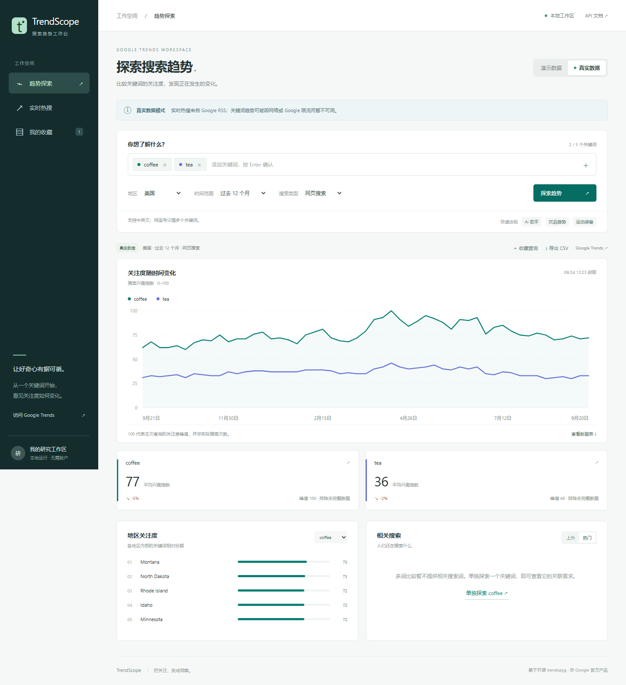

# TrendScope · Google 搜索趋势工作台

一个运行在本机的中文 Google Trends 研究工具：对比关键词关注度、发现实时热搜、收藏查询、导出数据，并跳转 Google Trends 或 Google 搜索。

数据层使用 [trendspyg](https://github.com/flack0x/trendspyg) 1.8.0，网页和后端由本项目实现。非 Google 官方产品。



## 功能

- **趋势探索**：1–5 个关键词，共用量纲的趋势曲线；国家/全球、时间范围和搜索类型筛选。
- **关键词摘要**：平均兴趣、峰值、最近 4 个完整数据点相较前 4 个的均值变化。
- **地区与相关搜索**：地区排行；单词查询提供上升/热门相关词，多词查询不伪造相关词。
- **实时热搜**：Google Trends RSS 热点、搜索量区间下限、关联新闻、跳转搜索及单词探索。
- **我的收藏**：在当前浏览器保存最多 30 个查询条件，支持恢复与删除。
- **CSV 导出**：包含来源、获取时间、筛选条件、关键词数据及不完整数据标记，防止公式注入。
- **演示模式**：启动时展示明确标注的合成数据，无网络也能体验。切换真实模式后，错误不会被演示数据掩盖。
- **移动端与键盘**：手机布局、图表方向键浏览、可展开数据表。

## 快速启动

需要 **Python 3.11+**。查询真实关键词趋势还需要 **Google Chrome**，以及能访问 Google Trends 和下载匹配浏览器驱动的网络。热搜 RSS 不需要浏览器。应用运行不依赖 Node.js，Node 仅用于前端工具测试。

### Windows

双击 `start.cmd`，或在 PowerShell 中运行：

```powershell
.\start.ps1
```

首次启动会建立 `.venv` 并安装锁定依赖。若 PowerShell 限制脚本执行，可使用 `start.cmd`。启动后访问：

**http://127.0.0.1:8787**

保持启动窗口运行，按 `Ctrl+C` 停止。如果端口被占用：

```powershell
.\start.ps1 -Port 8788
```

### 使用 uv（推荐，跨平台）

```sh
uv sync --frozen
uv run uvicorn app.main:app --host 127.0.0.1 --port 8787
```

### 使用 pip

```sh
python -m venv .venv
# Windows
.venv\Scripts\python -m pip install -r requirements.txt
.venv\Scripts\python -m uvicorn app.main:app --host 127.0.0.1 --port 8787
# macOS / Linux：将上面的 Python 路径改为 .venv/bin/python
```

## 使用流程

1. 页面默认打开演示模式，展示 AI 助手对比示例。
2. 切换「真实数据」，输入关键词并按 Enter 添加；支持中英文逗号分隔，最多 5 个。
3. 选择地区、时间范围、搜索类型，点击「探索趋势」。真实查询通常需要 10–90 秒，应用在约 150 秒后终止超时任务。
4. 图表支持鼠标悬停和左右方向键，表格可查看全部时间点。编辑筛选条件不会重新标注已有结果；需要再次查询。
5. 点击「收藏查询」保存当前结果的条件，或「导出 CSV」下载当前结果。
6. 「实时热搜」按具体国家/地区加载；点击「探索关键词」进入趋势查询。

## 数据口径与限制

- 0–100 为相对搜索兴趣指数，**不是绝对搜索量**。不同查询窗口或分别查询的词不能直接拼接比较。
- 多词曲线来自一次共同归一化查询。多词地区数据表示该地区内的词间相对份额；单词地区数据表示地区间归一化兴趣。
- 热搜的 `500+` 等搜索量是区间下限，与折线图指数不是同一种指标。
- 摘要统计排除尚不完整的时间点；CSV 和图表提示仍保留这些时间点并标记。
- 真实趋势数据成功后缓存 15 分钟；热搜缓存 5 分钟。缓存保留原始获取时间。
- 浏览器趋势请求一次只运行一个，新请求至少间隔 30 秒；上游返回 429 后冷却 5 分钟。Google 自身的限制可能更久，请勿持续重试。
- 收藏保存于当前浏览器 `localStorage`，不包含抓取结果；清理浏览器数据会丢失收藏。本版不提供云同步、自动提醒、账户或定时任务。
- 仅监听本机回环地址，不支持直接暴露到公网。查询关键词会发往 Google；没有额外遥测。

## 验证

```sh
uv sync --frozen
uv run pytest -q
node --test tests/frontend.test.mjs
```

不使用 uv 时安装 `requirements-dev.txt` 后运行 `.venv\Scripts\python -m pytest -q`。

离线测试验证输入边界、真实/演示隔离、共享量纲适配、缓存、限流、超时进程清理、链接与 CSV 安全。真实网络验证与浏览器验收见 [验证记录](docs/validation.md)。

## 项目结构

```text
app/
  main.py          本机 HTTP 服务、校验错误与静态页面
  models.py        请求模型及支持地区
  providers.py     缓存、并发限制、上游适配与进程生命周期
  worker.py        独立进程中调用 trendspyg
  demo.py          明确标注的合成演示数据
  static/          中文网页、样式、图表和前端逻辑
tests/             离线 Python 与 JavaScript 测试
docs/              需求、设计、实施、验证和开源来源说明
start.ps1          Windows 启动器
start.cmd          可双击的 Windows 启动入口
uv.lock            完整依赖锁
```

## 文档

- [产品需求与任务清单](docs/requirements.md)
- [架构设计](docs/superpowers/specs/2026-09-24-trends-workspace-design.md)
- [实施计划](docs/superpowers/plans/2026-09-24-trends-workspace.md)
- [开源项目调研与依赖归属](docs/sources.md)
- 本机 API 文档：启动后打开 `/docs`；机器可读结构：`/openapi.json`。

## 许可证

本项目代码采用 [MIT 许可证](LICENSE)。第三方依赖遵循各自许可证，Google 数据及品牌不因代码许可证而获得额外授权。依赖来源见 [THIRD_PARTY_NOTICES.md](THIRD_PARTY_NOTICES.md)。
